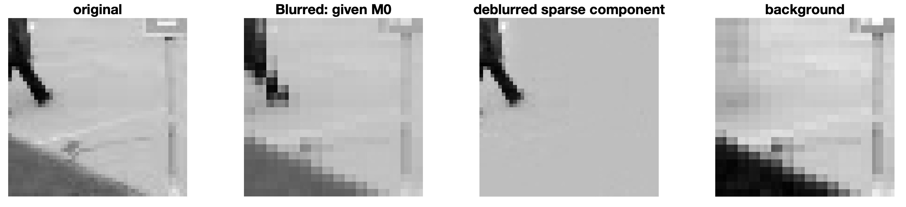
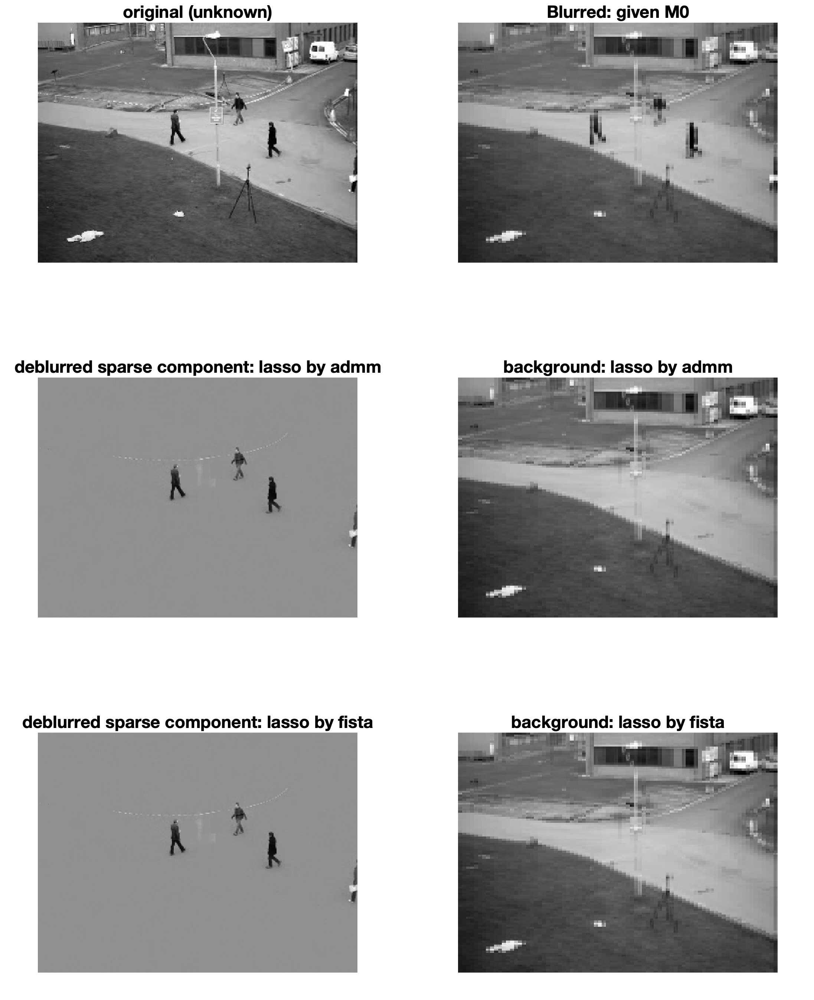

# Code for General Matrix Separation

## 1D
### H is the average filter
n = 300;
m = n - 1;
p = m;

run `test_1d_avg.m`. 

$$H=\begin{bmatrix}
-1&1&&&\\
&1&1&&\\
&&1&\ddots&\\
&&&\ddots&1\\
1&&&&1
\end{bmatrix}.$$

Matlab output:
```
Elapsed time is 31.496404 seconds.
Relative error of recovering L0: 1.500221e-03
Relative error of recovering S0: 4.986135e-04
Ran 500 many outer loops.
Input H was circulant? Answer: 1 
****** with preconditioning ******
Elapsed time is 2.878626 seconds.
Relative error of recovering L0: 2.379997e-05
Relative error of recovering S0: 2.141106e-06
Ran 28 many outer loops.
Input H was circulant? Answer: 0 
```

### H is iid N(0, 1)
n = 300;
m = 270;
p = 296;

run `test_1d_randn.m`. 

Matlab output:
```
Elapsed time is 50.797600 seconds.
Relative error of recovering L0: 8.633890e-01
Relative error of recovering S0: 3.132586e-03
Ran 500 many outer loops.
Input H was circulant? Answer: 0 
****** with preconditioning ******
Elapsed time is 6.419518 seconds.
Relative error of recovering L0: 3.337300e-04
Relative error of recovering S0: 8.266345e-07
Ran 99 many outer loops.
Input H was circulant? Answer: 0 
```

## 2D
### Gi are i.i.d N(0, 1)
m1 = 10;
p1 = 9;
m2 = 9;
p2 = 8;
K = 50;

run `test_2d_randn.m`

Matlab output:
```
Elapsed time is 0.738772 seconds.
Relative error of recovering L0: 3.156142e-01
Relative error of recovering S0: 1.530180e-03
Ran 200 many outer loops.
Input H was circulant? Answer: 0 
****** with preconditioning ******
Elapsed time is 0.101072 seconds.
Relative error of recovering L0: 1.065884e-05
Relative error of recovering S0: 7.374641e-08
Ran 54 many outer loops.
Input H was circulant? Answer: 0 
```
### Gi are circulant
run `test_2d_circ.m`

m1 = 20;
p1 = m1;
m2 = 18;
p2 = m2;
K = 50;

Matlab output
```
Elapsed time is 3.257809 seconds.
Relative error of recovering L0: 2.674311e-01
Relative error of recovering S0: 5.264092e-04
Ran 200 many outer loops.
Input H was circulant? Answer: 1 
****** with preconditioning ******
Elapsed time is 0.239408 seconds.
Relative error of recovering L0: 8.045549e-06
Relative error of recovering S0: 2.419491e-08
Ran 41 many outer loops.
Input H was circulant? Answer: 0 
```

### Gi block structured
run `test_2d_Ei.m`

m1 = 20;
m2 = 30;
p1 = m1;
p2 = m2;
K = 100;

Gi = kron(eye(mi/ni), Ei); Each Ei is NOT circulant.

Matlab output
```
Elapsed time is 4.842610 seconds.
Relative error of recovering L0: 1.615380e+01
Relative error of recovering S0: 8.527813e-01
Ran 104 many outer loops.
Input H was circulant? Answer: 0 
****** with preconditioning ******
Elapsed time is 0.827753 seconds.
Relative error of recovering L0: 6.747744e-07
Relative error of recovering S0: 1.704130e-08
Ran 38 many outer loops.
Input H was circulant? Answer: 0 
```

### Gi block circulant
run `test_2d_Ei_circ.m`

Gi = kron(eye(mi/ni), Ei); Each Ei is circulant.

Matlab output
```
Elapsed time is 6.414501 seconds.
Relative error of recovering L0: 3.199401e+01
Relative error of recovering S0: 9.344267e-01
Ran 153 many outer loops.
Input H was circulant? Answer: 0 
****** with preconditioning ******
Elapsed time is 0.907090 seconds.
Relative error of recovering L0: 6.122999e-07
Relative error of recovering S0: 1.717772e-08
Ran 34 many outer loops.
Input H was circulant? Answer: 0 
```

### Gi block circulant, 
run `test_2d_Ei_circ2.m`

Gi = kron(eye(mi/ni), Ei); Each Ei is circulant and mi/ni is small.

Matlab output
```
Elapsed time is 0.277345 seconds.
Relative error of recovering L0: 1.757333e+01
Relative error of recovering S0: 1.000000e+00
Ran 7 many outer loops.
Input H was circulant? Answer: 1 
****** with preconditioning ******
Elapsed time is 0.741093 seconds.
Relative error of recovering L0: 3.923171e-07
Relative error of recovering S0: 1.709341e-08
Ran 36 many outer loops.
Input H was circulant? Answer: 0
```

### video background removal and deconvolution simultaneously
run `test_2d_vid`

Matlab output
```
Elapsed time is 31.758500 seconds.
```


run `test_2d_vid_full`

Matlab output
```
Elapsed time is 1081.218442 seconds.
```
